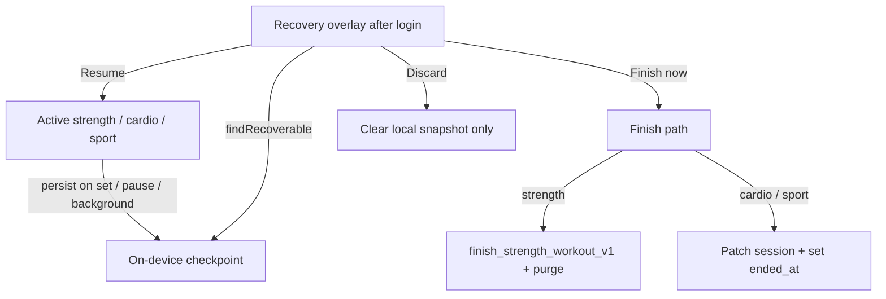

# Active workout crash recovery

Local checkpoints let a user **Resume**, **Finish now**, or **Discard** an in-progress strength, cardio, or sport session after a crash or force-quit. Shipping note: changelog **1.19.1**. Manual QA: [android-qa-checklist-add-detail-active.md](android-qa-checklist-add-detail-active.md) section F. Strength finish RPC / purge: [backend-contracts.md](backend-contracts.md#fin-de-entreno-en-vivo-finish_strength_workout_v1).

## Intent

Active sessions keep a draft row on the server (`workouts.ended_at` is null) and **progress lives on device** until finish. The checkpoint is a single on-device snapshot so the next authenticated launch can restore that progress instead of leaving an orphaned open workout.

The checkpoint is **not** a server sync. Discarding it does **not** delete or end the workout in Supabase.

## Architecture

| Layer | iOS | Android |
|-------|-----|---------|
| Snapshot model | [`Liftr/ActiveWorkoutSessionCheckpoint.swift`](../Liftr/ActiveWorkoutSessionCheckpoint.swift) | [`android/.../workout/ActiveWorkoutSessionCheckpoint.kt`](../android/app/src/main/java/com/lilru/liftr/workout/ActiveWorkoutSessionCheckpoint.kt) |
| Finish from dialog | `ActiveWorkoutRecoveryFinish` in the same Swift file | [`ActiveWorkoutRecoveryFinish.kt`](../android/app/src/main/java/com/lilru/liftr/workout/ActiveWorkoutRecoveryFinish.kt) |
| Dialog + Resume | [`ActiveWorkoutRecoveryOverlay.swift`](../Liftr/ActiveWorkoutRecoveryOverlay.swift) on [`RootView`](../Liftr/RootView.swift) | [`ActiveWorkoutRecoveryHost.kt`](../android/app/src/main/java/com/lilru/liftr/ui/active/ActiveWorkoutRecoveryHost.kt) in [`MainShellScreen`](../android/app/src/main/java/com/lilru/liftr/ui/main/MainShellScreen.kt) |
| Persist / restore | `ActiveStrengthWorkoutView`, `ActiveCardioWorkoutView`, `ActiveSportWorkoutView` | matching `ui/active/*ViewModel.kt` + `ON_STOP` on the screens |

Storage: **one slot** for the whole app. A newer session overwrites the previous snapshot.

| Platform | Where |
|----------|--------|
| iOS | `UserDefaults` key `liftr.activeWorkoutCheckpoint.v1` |
| Android | `SharedPreferences` `liftr_active_workout_checkpoint` / `entry.v1` |

Max age: **7 days** from `savedAt`. Stale snapshots are deleted locally and never offered.

## When the snapshot is written

**Strength (both platforms):** after completing a set (including dual/trio lanes on iOS), on pause/resume toggle, and when the UI leaves the foreground (`scenePhase` background/inactive on iOS; `Lifecycle.ON_STOP` on Android).

**Cardio / sport (iOS):** immediately on background/inactive; debounced **3s** while elapsed time ticks.

**Cardio (Android):** `ON_STOP` only. A kill that skips `ON_STOP` can lose elapsed time and GPS points since the last backgrounding.

**Sport (Android):** `ON_STOP`, plus running toggle, Hyrox station change, and climbing form edits.

Snapshots are cleared when the session finishes normally, when recovery Finish now succeeds (or is queued), on Discard, and when `findRecoverable` decides the row is already ended or owned by another user.

## Recovery dialog

Shown once after the user is authenticated (`task(id: isAuthenticated)` on iOS; `LaunchedEffect(isAuthenticated, supabase)` on Android). Title: **Unfinished workout**.

| Action | What it does |
|--------|----------------|
| **Resume** | Opens the matching active screen and rehydrates the snapshot (sets done, rest timers, cardio elapsed/route, sport/Hyrox station). Dual/trio guest IDs are passed through on Resume. |
| **Finish now** | Runs `ActiveWorkoutRecoveryFinish.finishNow` (see below). On success the snapshot is cleared. |
| **Discard** | Clears the **local** snapshot only. The server workout stays open (`ended_at` null). The dialog will not reappear until a new snapshot is written. |
| **Cancel** / dismiss | Leaves the snapshot in place. The dialog does not show again until the next auth/process launch. |

## `findRecoverable` rules

1. No snapshot → nothing to offer.
2. Older than 7 days → clear local, skip.
3. Load `workouts` row for `workoutId`. If `ended_at` is set → clear local, skip (already finished elsewhere).
4. If `user_id` ≠ current auth user → clear local, skip.
5. If the network/query **fails** → **still offer recovery** from the local snapshot (optimistic). Resume may then fail to load the program.

## Finish now

### Strength

Calls `finish_strength_workout_v1` with performed sets collapsed the same way as a normal active finish (`StrengthWorkoutFinishCollapse` / `StrengthWorkoutSaveRpc`). Paused seconds include any pause that was still open when Finish now ran.

On a **retriable** network error, the payload is enqueued in `WorkoutFinishSync` (iOS `UserDefaults`; Android WorkManager) and the snapshot is cleared so the user is not stuck. Cardio and sport **have no** equivalent offline queue: Finish now surfaces the error and keeps the snapshot.

After a successful (or queued) strength finish, Postgres purges incomplete template rows — see [Strength finish purge](#strength-finish-purge).

**iOS dual/trio:** guest performed sets are stored in the snapshot and sent as `p_linked`.

**Android dual/trio:** the checkpoint stores `guestWorkoutId` / `guest2WorkoutId` for Resume, but **guest performed maps are always empty** and recovery Finish now does **not** pass `linked`. Guest lanes are not crash-recovered on Android; Finish now from the dialog ends the host only.

### Cardio

Patches `cardio_sessions` (`duration_sec`, `distance_km` if > 0, `route_geojson` if ≥ 2 points as a GeoJSON `LineString` `[lon, lat]`), then sets `workouts.ended_at`. If `state` was `planned`, it becomes `published`.

### Sport

Patches `sport_sessions` (duration, scores, match result/location/notes) and the same `ended_at` / planned→published rule. Hyrox station progress is in the snapshot for Resume; Finish now does **not** rewrite Hyrox exercise rows — it only updates the sport session + workout end.

Android sport snapshots also include climbing form fields (`climbingSportStats`, `climbingRoutesJson`). iOS sport snapshots do not.

## Strength finish purge

Server-side cleanup so a finished strength workout does not keep template sets the user never performed.

**Apply before shipping clients that rely on purge** (changelog 1.19.1): [`Liftr/supabase/migrations/20260612111424_strength_workout_finish_purge_deploy_v1.sql`](../Liftr/supabase/migrations/20260612111424_strength_workout_finish_purge_deploy_v1.sql) (supersedes the earlier [`20260527120000_strength_workout_finish_purge_v1.sql`](../Liftr/supabase/migrations/20260527120000_strength_workout_finish_purge_v1.sql) with a safer `is_completed` backfill).

| Piece | Behavior |
|-------|----------|
| `exercise_sets.is_completed` | Finish RPC inserts performed sets as `true`. Live template rows stay `false`. |
| `_liftr_purge_incomplete_strength_workout` | Deletes `is_completed = false` sets, then `workout_exercises` with no remaining sets. No-op unless `workouts.kind` is `strength`. |
| Called from | `_liftr_finish_strength_workout_core` after replacing sets, **and** trigger `purge_incomplete_strength_on_workout_finalize` on `workouts` (`BEFORE UPDATE OF ended_at` when it goes null → not null). |
| Deploy extra | The deploy migration also deletes empty `workout_exercises` on **already ended** strength workouts. |

**Constraint:** an exercise with **zero** completed sets disappears from the saved workout. Partial exercises keep only completed sets. This applies to recovery Finish now as well as a normal Finish button.

## Constraints and pitfalls

- **One checkpoint.** Starting another active session overwrites the previous snapshot.
- **Discard ≠ delete.** The open workout remains in the feed/detail until the user finishes or deletes it from workout UI.
- **Android cardio persist is ON_STOP-only.** Force-stop during tracking can drop the last minutes of GPS/elapsed time.
- **Android dual/trio guests** are not in the snapshot; only the host's performed sets restore.
- **Cardio/sport Finish now** needs network; there is no retry queue.
- **Optimistic recover** when `workouts` cannot be fetched: the dialog still appears.
- Checkpoint JSON is not a public API. Do not hand-edit `UserDefaults` / SharedPreferences in production builds.

## Troubleshooting

| Symptom | Likely cause | What to check |
|---------|--------------|----------------|
| Dialog never appears after a crash | Snapshot never written, stale (>7d), workout already `ended_at`, or another user on the device | Confirm persist path (set completed or app backgrounded). Query `workouts.ended_at` for that id. |
| Dialog every cold start after Cancel | Cancel/dismiss does not clear storage | Use Discard, or Finish now / Finish in the active screen. |
| Discarded workout still listed | Expected | Open detail and Finish/Delete; Discard is local-only. |
| Strength Finish now succeeded but exercises vanished | Purge removed exercises with no completed sets | Confirm `is_completed` on remaining `exercise_sets`. Ensure deploy migration is applied. |
| Dual partner sets missing after Android Resume | Guest maps not persisted | Only iOS stores guest performed sets. Resume Android dual for navigation IDs only. |
| Cardio map empty after Resume | Fewer than 2 route points, or Android process death without `ON_STOP` | Finish now also skips `route_geojson` unless ≥ 2 points. |
| Finish now error, dialog gone | Strength: queued in `WorkoutFinishSync` and snapshot cleared. Cardio/sport: error should keep snapshot | iOS: key `liftr.pendingWorkoutFinishes.v1`. Android: prefs `liftr_workout_finish_sync`. |

## Local reproduction

1. Start a strength session, complete at least one set (so a snapshot exists even if you skip backgrounding).
2. Force-quit the app (iOS: swipe away; Android: force stop).
3. Relaunch and sign in. Expect **Unfinished workout** with Resume / Finish now / Discard.
4. **Resume:** completed sets and the current exercise index should restore; finishing the session clears the snapshot.
5. Repeat and choose **Discard:** next launch has no dialog; the workout is still open on the server.
6. Repeat and choose **Finish now** (with network): workout has `ended_at`; incomplete template sets are gone.

Do not use production accounts for destructive Discard/Finish experiments.
