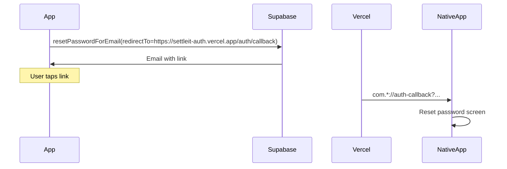

# Password reset (Supabase Auth)

Liftr uses Supabase email password recovery. The app sends reset emails with an HTTPS callback on **settleit-auth** (Vercel), which forwards into the native apps.

**Supabase project:** `rjzhaafvkxmvlnpsikbi`  
**Dashboard:** https://supabase.com/dashboard/project/rjzhaafvkxmvlnpsikbi

**Production callback URL:** `https://settleit-auth.vercel.app/auth/callback`  
**Vercel project:** [settleit-auth](https://vercel.com) → GitHub `Lilru-tech/settleit-auth`

---

## 1. Vercel (`settleit-auth`)

The live site is **`https://settleit-auth.vercel.app`**. Vercel deploys from **`Lilru-tech/settleit-auth`** on push to `main`.

### Update the callback page

Copy the bridge files from this repo into the **settleit-auth** GitHub repo, then push:

```bash
cd /Users/davidgomezsanchez/Desktop/Projects/Liftr/Liftr/web/auth-callback
./sync-to-settleit-auth.sh /Users/davidgomezsanchez/Desktop/Projects/settleit-auth
cd /Users/davidgomezsanchez/Desktop/Projects/settleit-auth
git add auth/callback/index.html vercel.json
git commit -m "Sync Liftr password-reset callback bridge"
git push origin main
```

Vercel will redeploy automatically. Confirm in a browser:

`https://settleit-auth.vercel.app/auth/callback`

You should see the Liftr “Opening Liftr…” page (or an expired-link message if you open a bad URL).

Source of truth for the HTML in this monorepo: [`web/auth-callback/`](../web/auth-callback/).

---

## 2. Supabase Auth URLs (required)

**Applied via CLI** (`supabase config push` from [`Liftr/supabase/config.toml`](../Liftr/supabase/config.toml)):

- **Site URL:** `https://settleit-auth.vercel.app` (was `http://localhost:3000`)
- **Redirect URLs:** settleit-auth HTTPS + Liftr app deep links
- **Recovery email template:** uses `{{ .ConfirmationURL }}`

To re-apply after editing `config.toml`:

```bash
cd Liftr
printf 'n\ny\n' | supabase config push --project-ref rjzhaafvkxmvlnpsikbi
```

Manual dashboard (same values): [Auth → URL Configuration](https://supabase.com/dashboard/project/rjzhaafvkxmvlnpsikbi/auth/url-configuration).

### Site URL

```
https://settleit-auth.vercel.app
```

### Redirect URLs

Add **all** of these:

```
https://settleit-auth.vercel.app/**
https://settleit-auth.vercel.app/auth/callback
com.davidgomez.Liftr://auth-callback
com.lilru.liftr://auth-callback
```

### Email provider

[Auth → Providers → Email](https://supabase.com/dashboard/project/rjzhaafvkxmvlnpsikbi/auth/providers) — ensure **Email** is enabled.

### Reset password email template

[Auth → Email Templates → Reset password](https://supabase.com/dashboard/project/rjzhaafvkxmvlnpsikbi/auth/templates)

```html
<h2>Reset your Liftr password</h2>
<p>Follow this link to choose a new password:</p>
<p><a href="{{ .ConfirmationURL }}">Reset password</a></p>
```

Do **not** use `localhost` or `{{ .SiteURL }}` alone for the link.

### After saving

Request a **new** reset email from the app. Old links will keep showing `otp_expired`.

New emails should link to **`settleit-auth.vercel.app`**, not `localhost:3000`.

---

## 3. How it works



| Platform | App deep link (after Vercel bridge) |
|----------|-------------------------------------|
| iOS | `com.davidgomez.Liftr://auth-callback` |
| Android | `com.lilru.liftr://auth-callback` |

| Platform | `resetPasswordForEmail` redirect |
|----------|-------------------------------|
| iOS / Android | `https://settleit-auth.vercel.app/auth/callback` |

---

## 4. Troubleshooting

| Symptom | Fix |
|---------|-----|
| Email opens `localhost:3000` | Set Site URL + Redirect URLs (section 2); send a fresh reset email |
| `otp_expired` | Request a new link from Profile → Forgot password |
| App does not open | Tap **Open Liftr** on the Vercel page; check Redirect URLs include app schemes |
| 404 on Vercel | Sync `public/auth/callback/index.html` to `settleit-auth` repo and redeploy |
| iOS opens but stays on the wrong tab with no reset form | Reset UI is presented as a **full-screen cover** on top of any tab when `passwordRecoveryPending` is true (`RootView`). Request a fresh email after updating the app. |
| iOS opens but nothing happens | Capture `[AuthCallback]` logs (section below). If you never see `AppDelegate application(open:)` or `SwiftUI onOpenURL`, the deep link is not reaching the app — reinstall, request a fresh email, tap **Open Liftr** on the Vercel page. |

### Capture iOS auth-callback logs

1. Connect the iPhone to a Mac and open the Liftr project in Xcode.
2. Run Liftr on the device from Xcode (**Product → Run**).
3. Open the **Debug area** console (View → Debug Area → Activate Console).
4. In the console filter box, type `AuthCallback`.
5. Request a **new** reset email, tap the link, and let Liftr open.
6. Copy every line that starts with `[AuthCallback]` and share them.

What to look for:

| Log line | Meaning |
|----------|---------|
| `AppDelegate application(open:)` or `SwiftUI onOpenURL` | The app received the deep link |
| `ignored: URL did not match` | Wrong scheme/host — paste the full `url=` line |
| `exchange succeeded` | Session OK — Profile should show **Reset password** |
| `exchange failed` | Expired or invalid link — request a new email |
| No `[AuthCallback]` lines at all | URL never reached Liftr — use the Vercel fallback button |

---

## 5. Code references

- Bridge source (copy to settleit-auth): [`web/auth-callback/`](../web/auth-callback/)
- iOS: [`Liftr/AuthRedirect.swift`](../Liftr/AuthRedirect.swift)
- Android: [`AuthRedirect.kt`](../android/app/src/main/java/com/lilru/liftr/auth/AuthRedirect.kt)
