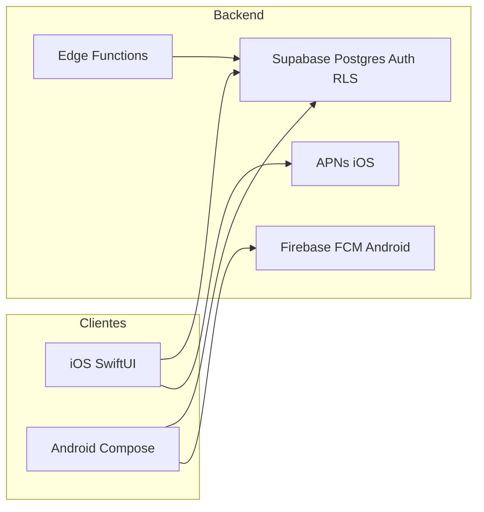

# Resumen del repositorio Liftr (para explicar la app)

Documento interno derivado del inventario del repo. Para el histórico detallado de versiones, mantener alineación con [../Liftr/changelog.md](../Liftr/changelog.md). Para paridad entre plataformas, con [android-parity-inventory.md](android-parity-inventory.md) y [../android/ADD_WORKOUT_PARITY.md](../android/ADD_WORKOUT_PARITY.md).

## Qué es Liftr

**Liftr** es una app social de **seguimiento de entrenamientos** (fuerza, cardio y deportes de equipo/individuales), **progreso**, **puntuación**, **metas semanales**, **competiciones**, **logros**, **rankings** e **importación desde salud** (HealthKit en iOS, Health Connect en Android). El backend vive en **Supabase** (Auth, Postgres, RPC, notificaciones vía funciones edge según el repo).

Referencia de alto nivel: [../README.md](../README.md), [../Liftr/readme.md](../Liftr/readme.md), inventario de contratos en [backend-contracts.md](backend-contracts.md).

## Arquitectura del repositorio

- **iOS**: proyecto Xcode, entrada [`../Liftr/LiftrApp.swift`](../Liftr/LiftrApp.swift) → [`../Liftr/RootView.swift`](../Liftr/RootView.swift) (tabs), estado global [`../Liftr/AppState.swift`](../Liftr/AppState.swift), cliente Supabase en [`../Liftr/SupabaseManager.swift`](../Liftr/SupabaseManager.swift).
- **Android**: módulo Gradle en `android/`, [`../android/app/src/main/java/com/lilru/liftr/MainActivity.kt`](../android/app/src/main/java/com/lilru/liftr/MainActivity.kt) → [`../android/app/src/main/java/com/lilru/liftr/ui/LiftrAppContent.kt`](../android/app/src/main/java/com/lilru/liftr/ui/LiftrAppContent.kt) → shell [`../android/app/src/main/java/com/lilru/liftr/ui/main/MainShellScreen.kt`](../android/app/src/main/java/com/lilru/liftr/ui/main/MainShellScreen.kt); contratos centralizados en [`../android/app/src/main/java/com/lilru/liftr/data/BackendContracts.kt`](../android/app/src/main/java/com/lilru/liftr/data/BackendContracts.kt).
- **Backend en repo**: SQL de referencia en `docs/migrations/`; edge en [`../Liftr/supabase/functions/send-notifications/index.ts`](../Liftr/supabase/functions/send-notifications/index.ts) y [`../Liftr/supabase/functions/delete-auth-user/index.ts`](../Liftr/supabase/functions/delete-auth-user/index.ts). El catálogo de tablas/RPC usable para “qué hay en servidor” está documentado en [backend-contracts.md](backend-contracts.md).

## Navegación principal (las 5 pestañas)

En **iOS** y **Android** la estructura es equivalente: **Home**, **Búsqueda**, **Añadir entreno**, **Ranking**, **Perfil** (con avatar en la barra donde aplica; badge de notificaciones en perfil).

- iOS: [`../Liftr/RootView.swift`](../Liftr/RootView.swift) (`Tab`: home, search, add, ranking, profile).
- Android: [`../android/app/src/main/java/com/lilru/liftr/ui/main/MainShellScreen.kt`](../android/app/src/main/java/com/lilru/liftr/ui/main/MainShellScreen.kt) (`MainTab`).

## Dominios de producto (qué puedes contar funcionalmente)

### 1. Cuenta y perfil

- Registro / login (Supabase Auth), gate de sesión ([`../Liftr/ProfileGate.swift`](../Liftr/ProfileGate.swift); en Android flujo auth en `ui/auth/` + [`../android/app/src/main/java/com/lilru/liftr/auth/AuthViewModel.kt`](../android/app/src/main/java/com/lilru/liftr/auth/AuthViewModel.kt)).
- Perfil: bio, avatar, datos personales, soporte ([`../Liftr/ContactSupportForm.swift`](../Liftr/ContactSupportForm.swift)), FAQs ([`../Liftr/FAQsView.swift`](../Liftr/FAQsView.swift)), borrado de cuenta (RPC `delete_my_account` en contratos).
- Seguidores / siguiendo: [`../Liftr/FollowersListView.swift`](../Liftr/FollowersListView.swift) y equivalente Android.

### 2. Home y feed social

- Feed de entrenamientos publicados, filtros por tipo (strength / cardio / sport) y refinamiento por subtipo (deportes, actividad cardio, grupo muscular en fuerza) — ver [`../Liftr/HomeView.swift`](../Liftr/HomeView.swift) y changelog reciente.
- Tarjetas de entreno, likes, participantes, puntuación; resúmenes mensuales y PRs en home según implementación en `HomeView`.

### 3. Crear y registrar entrenamientos

- **Modos Add vs Plan**: publicado vs planificado (enum `PublishMode` en [`../Liftr/AddWorkoutSheet.swift`](../Liftr/AddWorkoutSheet.swift)).
- **Fuerza**: ejercicios del catálogo, series/reps/peso/descansos, plantillas **rutinas** con carpetas, orden, duplicados, hash de contenido (changelog 1.9.x).
- **Grupo / dual en el mismo dispositivo**: participantes, “misma sesión” vs “por persona”, enlaces en BD (changelog 1.8.x; RPC como `plan_strength_squad_programs`, `create_linked_strength_workout_copy` en [backend-contracts.md](backend-contracts.md)).
- **Cardio**: tipos de actividad, GPS, ruta GeoJSON, splits por km, Live Activity en iOS; foreground service + widget en Android ([android-parity-inventory.md](android-parity-inventory.md)).
- **Deportes**: muchos deportes con stats específicas (padel, fútbol, Hyrox, ski, etc.); tablas `*_session_stats` listadas en contratos.
- **Recomendaciones** de entreno: [`../Liftr/WorkoutRecommendationService.swift`](../Liftr/WorkoutRecommendationService.swift) / motor en Android `WorkoutRecommendationEngine.kt`.
- **Cuenta atrás** antes de empezar: pantallas enlazadas desde detalle (paridad documentada en [../android/ADD_WORKOUT_PARITY.md](../android/ADD_WORKOUT_PARITY.md)).

### 4. Entreno activo (en vivo)

- Pantallas dedicadas: fuerza ([`../Liftr/ActiveStrengthWorkoutView.swift`](../Liftr/ActiveStrengthWorkoutView.swift)), cardio ([`../Liftr/ActiveCardioWorkoutView.swift`](../Liftr/ActiveCardioWorkoutView.swift)), deporte ([`../Liftr/ActiveSportWorkoutView.swift`](../Liftr/ActiveSportWorkoutView.swift)).
- iOS: **Live Activities** / Dynamic Island ([`../Liftr/WorkoutLiveActivityManager.swift`](../Liftr/WorkoutLiveActivityManager.swift), targets `LiftrWorkoutLiveActivity*`).
- Android: tracking GPS, efectos y ViewModels bajo `ui/active/`, widget/refresh en `ongoing/`.

### 5. Detalle, edición y duplicar

- [`../Liftr/WorkoutDetailView.swift`](../Liftr/WorkoutDetailView.swift): comentarios, likes, metadatos ([`../Liftr/EditWorkoutMetaSheet.swift`](../Liftr/EditWorkoutMetaSheet.swift)), ayuda ([`../Liftr/WorkoutHelpSheet.swift`](../Liftr/WorkoutHelpSheet.swift)).
- Apertura desde notificaciones / deep links (Android: [`../android/app/src/main/java/com/lilru/liftr/ui/home/WorkoutDetailFromNotificationOverlay.kt`](../android/app/src/main/java/com/lilru/liftr/ui/home/WorkoutDetailFromNotificationOverlay.kt), `NotificationRouter`).

### 6. Salud: importación

- **iOS**: HealthKit — [`../Liftr/AppleHealthImportView.swift`](../Liftr/AppleHealthImportView.swift), [`../Liftr/HealthKitCardioImportService.swift`](../Liftr/HealthKitCardioImportService.swift).
- **Android**: Health Connect — `HealthConnectImportScreen.kt` (mismo RPC cardio v2 que iOS, según inventario de paridad).

### 7. Búsqueda y descubrimiento

- [`../Liftr/SearchView.swift`](../Liftr/SearchView.swift): usuarios y entrenos, trending 24h, recientes, logging vía RPC (`record_search`, `trending_search_queries_24h`, etc. en contratos).

### 8. Ranking y nivel

- [`../Liftr/RankingView.swift`](../Liftr/RankingView.swift): múltiples tablas (p. ej. score, calorías, nivel, mejores entrenos, **metas completadas**, **duels ganados** — ver changelog 1.10.1), alcance Global/Friends y periodos.
- Detalle de nivel: [`../Liftr/UserLevelDetailView.swift`](../Liftr/UserLevelDetailView.swift); umbrales en tabla `level_thresholds`.

### 9. Metas semanales

- [`../Liftr/GoalsView.swift`](../Liftr/GoalsView.swift), [`../Liftr/GoalsManager.swift`](../Liftr/GoalsManager.swift), contribuciones [`../Liftr/GoalContributionsView.swift`](../Liftr/GoalContributionsView.swift); RPC `get_weekly_goal_recommendation`, `recompute_weekly_goal_results`, tablas `weekly_goals` / `weekly_goal_results`.

### 10. Logros

- [`../Liftr/AchievementsGridView.swift`](../Liftr/AchievementsGridView.swift); desbloqueo vía `get_user_achievements` y `check_and_unlock_achievements_for` (lógica principal en BD; convención de iconos documentada en [backend-contracts.md](backend-contracts.md)).

### 11. Comparar entrenos y PRs

- Comparación sesión a sesión: [`../Liftr/CompareWorkoutsView.swift`](../Liftr/CompareWorkoutsView.swift) (búsqueda, métricas de descanso en fuerza, Hyrox, cardio fastest km, etc. — changelog).
- Comparación temporal / period training: [`../Liftr/PeriodCompareView.swift`](../Liftr/PeriodCompareView.swift) con RPC `get_period_training_compare_v1` (SQL de referencia en [migrations/period_training_compare_v1.sql](migrations/period_training_compare_v1.sql)); soporte **tú vs tú** (dos ventanas) y **tú vs otro** (1.10.1).
- PRs: [`../Liftr/ComparePRsView.swift`](../Liftr/ComparePRsView.swift), vista `vw_user_prs`.

### 12. Consistencia y progreso en perfil

- [`../Liftr/ConsistencyDrillDownView.swift`](../Liftr/ConsistencyDrillDownView.swift), métricas en [`../Liftr/ConsistencyChartMetric.swift`](../Liftr/ConsistencyChartMetric.swift); en Android `ProfileProgressScreen`, gráficos en `ui/profile/progress/`.
- Calendario de actividad en perfil (Android: `ProfileCalendarCard.kt` entre los cambios recientes).

### 13. Competiciones

- Hub, detalle, crear, envíos y revisiones: carpeta [`../Liftr/Competition/`](../Liftr/Competition/) en iOS; `ui/competition/*` en Android; RPC `submit_workout_to_competition`, `review_competition_workout`, tablas `competitions`, `competition_workouts`, etc.

### 14. Roadmap / voz del usuario

- Peticiones de funcionalidad: [`../Liftr/FeatureRequestsListView.swift`](../Liftr/FeatureRequestsListView.swift), API [`../Liftr/FeatureRequestsAPI.swift`](../Liftr/FeatureRequestsAPI.swift), vistas de crear/detalle; vistas SQL `vw_feature_requests`.

### 15. Notificaciones push

- iOS: [`../Liftr/NotificationTokenUploader.swift`](../Liftr/NotificationTokenUploader.swift), [`../Liftr/NotificationsListView.swift`](../Liftr/NotificationsListView.swift).
- Android: FCM en `LiftrAppContent` / `FcmTokenUploader`, [`../android/app/src/main/java/com/lilru/liftr/ui/notifications/NotificationsScreen.kt`](../android/app/src/main/java/com/lilru/liftr/ui/notifications/NotificationsScreen.kt), router de intents.

### 16. Monetización y anuncios

- Anuncios: [`../Liftr/BannerAdView.swift`](../Liftr/BannerAdView.swift), [`../Liftr/TopBanner.swift`](../Liftr/TopBanner.swift); en Android UMP/consent y red de anuncios (ver `MainActivity`, docs de paridad).
- Premium / billing Play: [`../android/app/src/main/java/com/lilru/liftr/billing/PlayBillingManager.kt`](../android/app/src/main/java/com/lilru/liftr/billing/PlayBillingManager.kt) (Android); iOS suele usar `@AppStorage("isPremium")` en varias vistas.

### 17. Calidad de producto en cliente

- Comprobación de actualización: [`../Liftr/AppUpdateChecker.swift`](../Liftr/AppUpdateChecker.swift), en Android Play Store update prompt.
- Documentación operativa: [publishing.md](publishing.md), [android-play-release.md](android-play-release.md), [postgres-sql-execution-notes.md](postgres-sql-execution-notes.md).

## Inventario de Swift (pantallas / módulos clave)

Los archivos `.swift` bajo `Liftr/` cubren lo anterior; nombres representativos además de los ya citados: `RegisterView`, `LoginView`, `WorkoutCard`, `ExercisePickerSheet`, `PeriodCompareView`, `CompetitionsHubView`, `GoalsView`, `RankingView`, `CompareWorkoutsView`, `AchievementsFromNotificationView`, etc.

## Paridad iOS ↔ Android

La fuente más útil para una **charla tipo “estamos en las dos plataformas”** es [android-parity-inventory.md](android-parity-inventory.md): resume que Android cubre las mismas áreas principales (tabs, competición, metas, logros, comparar, recomendaciones, notificaciones, Premium, Health Connect, calendario en perfil, GPS cardio, FGS + widget). Detalle fino de “Añadir entreno”: [../android/ADD_WORKOUT_PARITY.md](../android/ADD_WORKOUT_PARITY.md).

## Historial de versiones

- [../Liftr/changelog.md](../Liftr/changelog.md) es el mejor guion **cronológico** de funcionalidades ya lanzadas (desde MVP hasta versiones recientes con rankings, comparación periodo, logros, etc.).

## Cómo usar este resumen al hablar

1. **Una frase**: app de entrenos multi-modalidad + social + metas + competiciones + rankings, con datos en Supabase.
2. **Tres pilares**: registrar entreno (fuerza/cardio/deporte) → ver progreso y consistencia → competir / rankear / logros.
3. **Diferenciadores recientes** (según changelog): grupo en un móvil, rutinas con carpetas, Health import, Live Activity/FGS, comparación avanzada y period compare.
4. **Técnico** (si preguntan): clientes nativos, Postgres + RPC con lista congelada en `BackendContracts` / `backend-contracts.md`, RLS, edge functions para notificaciones/borrado.

**Nota de seguridad**: en charlas técnicas, no repitas claves anónimas en claro; revisar configuración de claves (p. ej. `SupabaseManager`) y preferir secretos fuera del control de versiones.

**Mantenimiento de este doc**: al sacar una release relevante, revisar secciones “Dominios” y “Diferenciadores” contra entradas nuevas en `changelog.md` y el párrafo de estado en `android-parity-inventory.md`.
