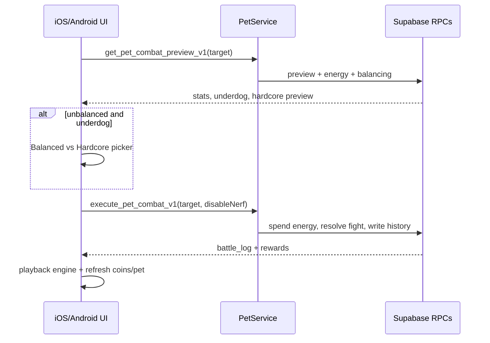

# Pet combat arena (engineering runbook)

Server-authoritative PvP for Liftr pets. Clients preview and play back battles; Postgres RPCs resolve outcomes, energy, rewards, and history. Deep schema and strike math live in [backend-contracts.md](backend-contracts.md#pets-mascots).

## Intent

- Let users challenge another user's active hatched pet from profile / opponent sheets.
- Keep combat fair enough at same level/rarity across production archetypes (~40–60% head-to-head).
- Gate attempts with energy and a per-opponent cooldown; never trust the client for damage, XP, or coins.

## Architecture



| Layer | Responsibility |
|-------|----------------|
| Clients | Challenge UX, mode prefs, playback of `battle_log`, local help sheets |
| `execute_pet_combat_v1` | Auth, energy −1, cooldown, handicap/hardcore, strike loop, rewards, history |
| `pet_type_stat_weights` + recompute | Archetype balance after weight migrations |
| Verify scripts | Post-deploy checks and Monte Carlo parity |

## Client entry points

| Platform | Service / models | UI |
|----------|------------------|----|
| iOS | [`Liftr/Pet/PetService.swift`](../Liftr/Pet/PetService.swift), `PetCombatModels.swift` | `OpponentPetChallengeSheet`, `PetCombatUnbalancedMatchDialog`, `PetCombatArenaView`, `PetStatCombatHelpSheet`, `PetDexView` |
| Android | [`PetService.kt`](../android/app/src/main/java/com/lilru/liftr/data/PetService.kt), `PetCombatModels.kt`, RPCs in `BackendContracts.Rpc` | `OpponentPetChallengeSheet`, `PetCombatUnbalancedMatchDialog`, `PetCombatArenaScreen`, `PetStatCombatHelpScreen`, `PetDexScreen` |

**Public RPCs (authenticated):**

| RPC | Params | Role |
|-----|--------|------|
| `get_pet_combat_preview_v1` | `p_target_user_id` | Pre-fight snapshot, energy JSON, `stat_balancing` |
| `execute_pet_combat_v1` | `p_target_opponent_user_id`, `p_disable_nerf_choice` (default `false`) | Resolve fight |
| `get_pet_combat_head_to_head_v1` | `p_opponent_user_id` | Competitive W/L/D (excludes `is_handicapped` rows) |
| `get_pet_combat_user_stats_v1` | — | Global combat aggregates |
| `get_my_pet_dex_v1` / `get_pet_species_detail_v1` | species optional | PetDex discovery |
| `upgrade_pet_energy_capacity_v1` | — | Raise `profiles.max_energy` (coin cost) |

After `executeCombat`, both clients refresh `CoinManager` and notify pet state refresh buses.

## Constraints operators and clients must respect

1. **Energy:** default `current_energy` / `max_energy` = 5. Each successful execute costs **1** energy. Regen is **1 point every 4 hours** (lazy via `liftr_refresh_profile_energy`). Energy columns are server-managed (`energy_fields_are_server_managed` if clients try to write them).
2. **Cooldown:** same attacker → defender pair blocked for **24 hours** after a fight (`liftr_combat_cooldown_expires_at` → `cooldown_active`).
3. **Pets:** both sides need an active equipped pet that is **not** an egg (`attacker_no_pet` / `defender_no_pet` / `*_egg`).
4. **No self-challenge:** `self_challenge`.
5. **Handicap:** combat pool = sum of 10 stats (excludes `happiness`). Unbalanced when `max(pool) * 100 > min(pool) * 105`.
   - **Balanced (default):** nerf the stronger side in-memory to `floor(weaker_pool × 1.05)`.
   - **Hardcore:** only if attacker is underdog and passes `p_disable_nerf_choice = true`; defender keeps full stats; scaled rewards on underdog win, minimum (`xp:10`, `coins:5`) if the strong side wins.
6. **History flag:** any unbalanced fight sets `pet_combat_history.is_handicapped = true`. Head-to-head competitive counts skip those rows; `pet_combat_user_stats` still counts all fights.
7. **Loser rewards:** `liftr_combat_loser_rewards` → ~25% of winner XP/coins, floored with minima (`xp ≥ 3`, `coins ≥ 1`).
8. **Strike engine:** production path uses `liftr_combat_strike_v4` + `liftr_combat_battle_hp_v1` (battle HP ≈ 80% of raw health). `liftr_combat_strike_v3` remains for rollback only.
9. **Client prefs (local only):** `skipPetCombatUnbalancedWarning`, `petCombatChallengeMode` (`balanced` | `hardcore`) — iOS `@AppStorage`, Android `LiftrPreferences`.

## Balance changes (v4 / v5 ops)

Weight and formula migrations live under `Liftr/supabase/migrations/`:

| Migration | What it does |
|-----------|----------------|
| `20260625120000_liftr_combat_balance_v4.sql` | Strike v4, battle HP helper, archetype floors/caps |
| `20260625120100_liftr_combat_balance_recompute_v1.sql` | `recompute_pet_stats_combat_balance_v1()` after v4 |
| `20260626120000_liftr_combat_balance_v5_weights.sql` | Production weight tweaks (`neon_panther`, `griffin`, `dragon`, …); weights sum to **40** |
| `20260626120100_liftr_combat_balance_v5_recompute.sql` | Recompute after v5 |

**Deploy order:** apply weight/formula SQL → run recompute migration → run verify scripts before shipping client-facing balance claims.

**Verify:**

```bash
# From repo root, against a non-prod DB with psql / Supabase SQL editor
# (see docs/postgres-sql-execution-notes.md for dollar-quoting pitfalls)
psql "$DATABASE_URL" -f Liftr/supabase/verify/combat_balance_v5.sql
python3 Liftr/supabase/verify/combat_balance_v5_monte_carlo.py
```

Monte Carlo expectations (from the script): production types `chocobo`, `griffin`, `monkey`, `neon_panther` at level 5; **2500** fights per pair; at least **5/6** pairs with win rate in **40–60%**.

Related verify files: `combat_balance_v4.sql`, `pet_combat_stat_handicap_v1.sql`, `pet_combat_hardcore_v1.sql`, `pet_combat_loser_rewards_v1.sql`, `pet_combat_dex_v1.sql`.

## Common failure modes

| Symptom / exception | Likely cause | What to check |
|---------------------|--------------|---------------|
| `no_energy` | Attacker at 0 energy | Preview `energy` JSON; wait for 4h regen or raise capacity |
| `cooldown_active` | Rematch within 24h | Last `pet_combat_history` row for that pair |
| `attacker_egg` / `defender_egg` | Egg not hatched | `get_my_pet_v1` / hatch cron |
| Hardcore ignored | Attacker not underdog or flag false | Preview underdog + `p_disable_nerf_choice` |
| H2H W/L looks low | Handicapped fights excluded | Compare to `pet_combat_user_stats` |
| Archetype feels broken after migrate | Weights applied without recompute | Run `recompute_pet_stats_combat_balance_v1()` + verify |
| Client coins stale after win | Forgot balance refresh | `CoinManager` refresh after execute (both apps already do this) |

## Adding or tuning an archetype

1. Update `pet_type_stat_weights` so the eleven weight columns still sum to **40**.
2. Ship a migration + recompute (same pattern as v5).
3. Mirror weights in `combat_balance_v5_monte_carlo.py` if the type is in the production parity set.
4. Update help copy only if player-facing roles change (`PetStatCombatHelpSheet` / Android strings).
5. Extend [backend-contracts.md](backend-contracts.md#pets-mascots) arena bullets; keep this runbook as the ops map.

## Related docs

- [backend-contracts.md — Pets & Mascots](backend-contracts.md#pets-mascots)
- [liftr-app-overview.md](liftr-app-overview.md)
- [postgres-sql-execution-notes.md](postgres-sql-execution-notes.md)
- Changelog notes: [`Liftr/changelog.md`](../Liftr/changelog.md) (1.19.x–1.20.x pets / combat)
