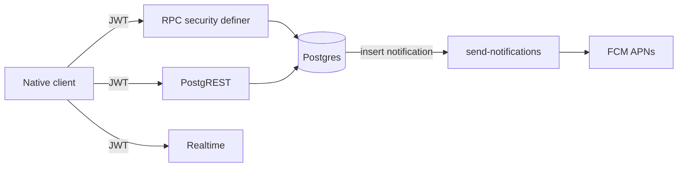

# Liftr — Technical API appendix (stakeholder pack)

**Audience:** Engineering leads, security review, integration partners  
**Canonical source:** [backend-contracts.md](../backend-contracts.md) (always wins on conflicts)  
**Client mirror:** [BackendContracts.kt](../../android/app/src/main/java/com/lilru/liftr/data/BackendContracts.kt)

---

## 1. Architecture summary

| Layer | Technology |
|-------|------------|
| iOS | SwiftUI · Supabase Swift client |
| Android | Jetpack Compose · Supabase Kotlin client |
| API | PostgREST (tables/views) + RPC (Postgres functions) + Realtime (chat) |
| Database | PostgreSQL + PostGIS (`territory_cells`, `segments`) |
| Auth | Supabase Auth (JWT per request) |
| Push | `notifications` table → Edge `send-notifications` → FCM / APNs |
| Migrations (repo) | `Liftr/supabase/migrations/` — 79 files (May 2026 incremental batch) |
| Edge functions | `send-notifications`, `delete-auth-user`, `resolve-territory-municipality`, `notify-new-user` |

---

## 2. Contract discipline

1. **iOS** (`Liftr/*.swift`) is the naming source of truth for new tables/RPCs.
2. **Android** must use `BackendContracts` constants — no magic strings in new queries.
3. On any contract change: update `BackendContracts.kt`, `backend-contracts.md`, and both clients in one PR.

---

## 3. Tables by domain

### Core workout hub

| Table | Purpose |
|-------|---------|
| `workouts` | Session header (kind, duration, visibility, calories, `healthkit_uuid`, `paused_sec`) |
| `workout_exercises` | Strength lines (order, superset group) |
| `exercise_sets` | Reps, weight, RPE, `weight_segments`, `order_index` |
| `workout_participants` | Group / dual sessions |
| `workout_scores` | Computed session score |
| `workout_likes` | Social likes |
| `workout_comments` | Comments; `mentioned_user_ids uuid[]` (max 10, followees only) |
| `workout_comment_likes` | Comment likes |

### Cardio

| Table | Purpose |
|-------|---------|
| `cardio_sessions` | Activity type, modality |
| `cardio_session_stats` | Distance, pace, elevation, **`route_geojson`** |
| `cardio_activity_types` | Lookup (public read) |

### Sport (per-type stats tables)

| Table | Purpose |
|-------|---------|
| `sport_sessions` | Parent for match/session sports |
| `basketball_session_stats`, `football_session_stats`, `handball_session_stats`, `hockey_session_stats`, `rugby_session_stats`, `volleyball_session_stats`, `racket_session_stats`, `ski_session_stats` | Typed metrics |
| `hyrox_session_stats`, `hyrox_session_exercises` | Hyrox stations and zones |

### Strength templates

| Table | Purpose |
|-------|---------|
| `strength_routine_folders` | Folder organization |
| `strength_routines`, `strength_routine_exercises`, `strength_routine_sets` | Saved programs (supersets supported) |
| `hyrox_routine_folders`, `hyrox_routines`, `hyrox_routine_exercises` | Hyrox templates |
| `exercises` | Global catalog |
| `user_favorite_exercises` | Favorites |

### Social graph & profile

| Table | Purpose |
|-------|---------|
| `profiles` | Username, avatar, `fcm_token`, display fields |
| `follows` | follower → followee |
| `body_weight_entries` | Manual + Health import samples |

### Chat

| Table | Purpose |
|-------|---------|
| `conversations` | DM / group threads |
| `conversation_participants` | Membership |
| `conversation_reads` | Read cursors |
| `messages` | Body, `kind`, share `metadata` |
| `message_attachments` | Media |
| `message_reactions` | Emoji reactions |

### Gamification

| Table | Purpose |
|-------|---------|
| `achievements`, `user_achievements` | Badge catalog and unlocks |
| `xp_events` | XP ledger |
| `level_thresholds` | Level curve (public read) |
| `weekly_goals`, `weekly_goal_results` | Weekly targets |
| `challenge_templates`, `challenge_instances`, `challenge_claims` | Time-boxed community challenges |
| `user_rankings_daily` | Daily ranking snapshot |

### Competitions & feedback

| Table | Purpose |
|-------|---------|
| `competitions`, `competition_goals`, `competition_blocks`, `competition_workouts` | Structured events |
| `feature_requests`, `feature_request_comments`, `feature_request_votes` | Product feedback |
| `contact_messages` | Support |

### Segments (Strava-like)

| Table | Purpose |
|-------|---------|
| `segments` | User-created route axis (PostGIS); `source_workout_id`, coverage fields |
| `segment_efforts` | Matched efforts; **`route_coverage`** ≥ 0.95 for leaderboard |

### Territory (map game)

| Table | Purpose |
|-------|---------|
| `territory_cells` | Polygon cell ownership (PostGIS) |
| `territory_capture_events` | Per-workout capture summary |
| `territory_capture_takeovers` | Social takeover events |
| `territory_municipalities` | City boundaries (OSM ingest) |
| `territory_city_regions`, `territory_city_geocode_cache`, `territory_city_geocode_queue` | City metadata and geocode pipeline |

### Notifications

| Table | Purpose |
|-------|---------|
| `notifications` | In-app + push queue (`sent_at`) |
| `user_notification_settings` | Granular `push_*` flags (DM, territory, mentions, Health import, …) |

### Storage (not a SQL table)

| Bucket | Purpose |
|--------|---------|
| `avatars` | Profile images |

### Read models (views)

| View | Purpose |
|------|---------|
| `vw_user_prs` | PR summary |
| `vw_workout_volume` | Volume aggregates |
| `vw_profile_counts` | Follower/workout counts |
| `vw_sport_session_full` | Sport session denormalized |
| `vw_feature_requests`, `vw_feature_request_comments` | Feedback UI |

---

## 4. RPCs by domain (representative)

Full list with parameters: [backend-contracts.md § Inventario de RPC](../backend-contracts.md).

### Workout lifecycle

| RPC | Role |
|-----|------|
| `create_strength_workout` | Create strength session |
| `update_strength_workout_v1` | Persist strength edits / finish |
| `create_cardio_workout_v2` | Create/merge cardio (Health dedupe) |
| `create_sport_workout_v2`, `update_sport_workout_v2` | Sport sessions |
| `start_workout_v1` | Mark `started_at` (idempotent) |
| `add_workout_participant` | Group participants |
| `create_linked_strength_workout_copy`, `plan_strength_squad_programs`, `fetch_dual_linked_strength_workout_data` | Dual/group strength |

### Feed & home

| RPC | Role |
|-----|------|
| `get_home_feed_page_v1` | Paginated feed JSON: workouts, scores, likes, participants |

### Compare & PRs

| RPC | Role |
|-----|------|
| `list_comparable_workouts_v1`, `can_compare_workout_v1` | Session compare |
| `list_compare_average_pool_v1` | Last-N average pool (mine \| global) |
| `get_period_training_compare_v1` | Period-over-period training |
| `get_user_prs` | PR lists (definer; cross-user read where allowed) |

### Rankings (sample — many `get_*_leaderboard_v1`)

| RPC | Metric |
|-----|--------|
| `get_leaderboard_v1` | Workout score |
| `get_calories_leaderboard_v1` | Calories |
| `get_strength_volume_leaderboard_v1` | Volume (optional muscle) |
| `get_cardio_distance_leaderboard_v1` | Distance |
| `get_sport_match_wins_leaderboard_v1` | Match wins |
| `get_goals_completed_leaderboard_v1` | Weekly goals completed |
| `get_duels_won_leaderboard_v1` | Duels won |
| `get_level_leaderboard_v1` | User level |
| `get_territory_total_cells_leaderboard_v1` | Territory cells |
| `get_territory_city_share_leaderboard_v1` | City share % |

### Territory

| RPC | Role |
|-----|------|
| `apply_territory_capture_v1` | Apply capture on publish (client cannot INSERT cells) |
| `preview_territory_capture_v1` | Preview before publish |
| `get_territory_map_v1` | Map tiles (capped; IO optimized) |
| `get_my_territory_summary_v1`, `get_territory_summary_v1` | User/city summaries |
| `list_territory_city_regions_v1` | City picker |
| `backfill_my_territory_captures_v1` | Historical backfill |
| `list_my_territory_recent_takeovers_v1`, `list_workout_territory_takeovers_v1` | Takeover feeds |

### Segments

| RPC | Role |
|-----|------|
| `create_segment_from_workout_v1` | Create segment from cardio route |
| `get_segment_detail_v1`, `get_segment_leaderboard_v1` | Detail + KOM board |
| `list_segments_near_v1`, `search_segments_v1`, `list_my_segments_v1` | Discovery |
| `match_segment_efforts_for_workout_v1` | Re-run matching |

### Chat

| RPC | Role |
|-----|------|
| `get_conversations_overview` | Inbox |
| `get_messages`, `send_message` | Thread read/write |
| `start_direct_conversation` | DM start (mutual follow rules in DB) |
| `mark_conversation_read`, `set_conversation_muted`, `toggle_message_reaction` | UX |

### Goals, achievements, challenges

| RPC | Role |
|-----|------|
| `get_weekly_goal_recommendation`, `recompute_weekly_goal_results`, `get_goal_stats` | Weekly goals |
| `get_user_achievements`, `check_and_unlock_achievements_for` | Achievements |
| `list_active_challenges_v1`, `get_challenge_instance_detail_v1`, `get_challenge_instance_leaderboard_v1` | Challenges |
| `evaluate_challenges_for_user` | Trigger-only (not client-callable) |

### Account & search

| RPC | Role |
|-----|------|
| `precheck_signup` | Username availability |
| `delete_my_account` | Account deletion |
| `record_search`, `trending_search_queries_24h`, `user_search_recent_list` | Search |
| `upsert_body_weight_entry` | Body weight |

### Competitions

| RPC | Role |
|-----|------|
| `submit_workout_to_competition`, `review_competition_workout` | Submissions and moderation |

---

## 5. Edge functions

| Function | Auth | Role |
|----------|------|------|
| `send-notifications` | Service | Poll `notifications` where `sent_at` is null; honor `user_notification_settings`; FCM v1 |
| `delete-auth-user` | User JWT + service role | `auth.admin.deleteUser` for GDPR delete |
| `resolve-territory-municipality` | Service / scheduled | Nominatim/OSM queue → `ingest_territory_municipality_v1` |
| `notify-new-user` | Webhook | Resend email to admins on signup |

Clients invoke (with session JWT): `delete-auth-user`, `resolve-territory-municipality` (operator paths).

---

## 6. Security model (review checklist)

| Pattern | Implementation |
|---------|------------------|
| User-owned rows | RLS `auth.uid() = user_id` on profiles, routines, body weight, etc. |
| Authenticated read-all | `territory_cells`, `territory_capture_events` — SELECT only |
| Client write blocked | `REVOKE INSERT/UPDATE/DELETE` on territory tables; mutations via **`security definer` RPCs** |
| Chat | `is_conversation_member(conversation_id)`; DMs require mutual follow |
| Segment/territory game logic | Triggers + definer functions; not client-writable |
| Views | `security_invoker = true` on reporting views so base-table RLS applies |
| Push types | `comment_mention`, `territory_*`, `segment_you_are_first`, `segment_lost_first`, `challenge_won`, Health import, etc. |

**Implication for auditors:** Cheating (fake GPS territory, inflated scores) requires compromising RPC definitions or service role — not PostgREST table PATCH.

---

## 7. Cardio import deduplication

Documented in [backend-contracts.md § Cardio import](../backend-contracts.md):

- Column `workouts.healthkit_uuid` — unique per user when set
- `create_cardio_workout_v2` merges duplicates (±5 min start, ±10% duration) via `merge_cardio_workout_from_import`
- Android prefix: `hc:{id}`; iOS: HealthKit UUID lowercase

---

## 8. Performance notes (ops)

| Area | Mitigation |
|------|------------|
| Home feed | `get_home_feed_page_v1` single round-trip |
| Territory map | `get_territory_map_v1` cell cap (5000) |
| Spatial growth | Monitor `territory_cells` row count — see [supabase-disk-io-baseline.md](../supabase-disk-io-baseline.md) |

---

## 9. What is NOT in the database (yet)

| Capability | Current state |
|------------|---------------|
| Subscription entitlements | Premium is client IAP / `isPremium` local flag — **no** `subscriptions` table in contract docs |
| In-repo full DDL | Baseline schema is remote; repo has incremental migrations only |

**Recommendation:** Add server-verified entitlements before treating subscription revenue as audited KPI.

---

## 10. Full contract document

The appendix above is a **stakeholder index**. For RPC parameters, segment coverage rules, challenge `metric_kind` values, achievement triggers, and change policy, use the complete document:

**[../backend-contracts.md](../backend-contracts.md)**

Includes:

- Complete table and view inventory
- Complete RPC inventory with behavioral notes
- Challenges MVP semantics vs achievements vs weekly goals
- Achievements client contract and Supabase inspection SQL reference
- `start_workout_v1` / finish offline queue semantics
- Contract change policy (3-step PR rule)

---

## 11. Related technical docs

| Doc | Topic |
|-----|-------|
| [liftr-app-overview.md](../liftr-app-overview.md) | Product domains → Swift/Android files |
| [android-parity-inventory.md](../android-parity-inventory.md) | Screen-level parity |
| [supabase-disk-io-baseline.md](../supabase-disk-io-baseline.md) | Query performance baseline |
| [postgres-sql-execution-notes.md](../postgres-sql-execution-notes.md) | Running SQL safely |
| [auth-password-reset.md](../auth-password-reset.md) | Auth redirect / Vercel bridge |
