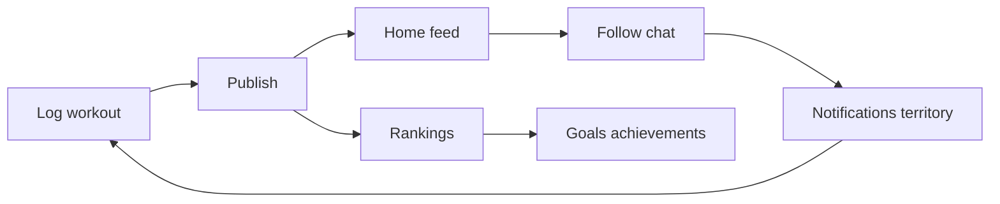
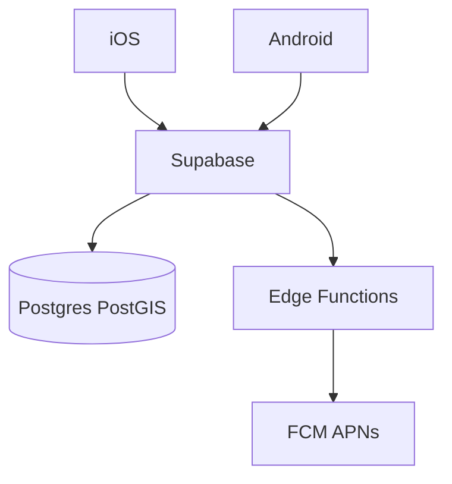

# Liftr — Executive deck (8 slides)

Use one section per slide. Speaker notes are indented under each slide title.

---

## Slide 1 — Vision

**Social training OS for gym and outdoor athletes**

Liftr is a consumer fitness app where athletes log strength, cardio, and team sports; share progress with a follow graph; and compete through scores, goals, rankings, achievements, route segments, and a map-based territory game.

- **One account, many modalities** — not a single-sport tracker
- **Native iOS + Android** on one Supabase backend
- **Positioning:** Strava-grade social cardio + gym-grade strength/Hyrox + playable territory

> Speaker note: Open with the problem — athletes juggle Strava for runs and another app for the gym. Liftr unifies logging, social proof, and retention games in one product.

---

## Slide 2 — Who we serve

**CrossFit / Hyrox · Runners & cyclists · Team sport players · Gym lifters who want accountability**

| Segment | What they get |
|---------|----------------|
| Strength athletes | Routines, supersets, drop sets, PRs, volume compare |
| Outdoor cardio | GPS routes, splits, Health import, **territory capture** |
| Hyrox / functional | Zones, saved routines, official-race leaderboards |
| Social trainers | Feed, chat, competitions, weekly goals |

> Speaker note: You do not need four apps — one graph, one feed, one ranking surface. Territory is the hook for runners; depth in strength/Hyrox is the hook for gym users.

---

## Slide 3 — The product loop

**Log → publish → feed & rankings → follow & chat → compete → return**

Five tabs on both platforms: **Home · Search · Add · Ranking · Profile**

> Speaker note: Retention is not “open the app to log” only — it is notifications, territory takeovers, segment KOMs, goal streaks, and chat shares pulling users back.

---

## Slide 4 — Differentiators (moat)

**Depth + server-side game rules — hard to clone without the backend**

| Layer | Liftr advantage |
|-------|-----------------|
| Strength / Hyrox | Routines, supersets, squad programs, personalized rest, compare vs last 10 / community avg 50 |
| Territory | PostGIS cells on outdoor cardio routes; city share leaderboards; takeover social events |
| Segments | Strava-like segments with route-coverage scoring and rank notifications |
| Security | Row Level Security + **RPC-only** mutations for territory, scoring, segment matching |
| Dual platform | Contract-locked API (`BackendContracts`) — iOS and Android stay aligned |

> Speaker note: Competitors can copy UI screenshots; they cannot easily copy 79 migrations of game logic and RPC enforcement without rebuilding the data model.

---

## Slide 5 — Traction proxies (shipping velocity)

**Recent releases show execution, not a slide-deck prototype**

| Version | Highlights |
|---------|------------|
| **1.12** | Chat (workout/routine/segment/achievement shares), strength supersets & drop sets, segment profiles |
| **1.13** | **Territory capture** on cardio, Hyrox routine editing, Apple Health auto-import, body weight history |
| **1.14** | Compare vs last 10 / avg 50, cardio dedupe on import, comment @mentions, feed performance |

Backend: **79 SQL migrations** (May 2026), **4 edge functions**, territory geocoding worker in CI.

> Speaker note: Point stakeholders to `Liftr/changelog.md` for the full timeline from MVP to today.

---

## Slide 6 — Technical credibility

**Production-shaped architecture**

| Component | Choice |
|-----------|--------|
| Clients | SwiftUI (iOS), Jetpack Compose (Android) |
| Backend | Supabase — Auth, Postgres + PostGIS, Realtime, Edge Functions |
| Push | FCM (Android) + APNs (iOS) via `send-notifications` worker |
| Delivery | Xcode Cloud / TestFlight; GitHub Actions + Play AAB |
| Tests | Regression on territory, strength save, auth, Health import |

> Speaker note: No React Native rewrite — intentional native UX for GPS, Live Activities, foreground workout service, and store billing.

---

## Slide 7 — Business model

**Freemium today — ads + Premium ad-free**

| Revenue | Status |
|---------|--------|
| Banner ads | Active (with consent / UMP on Android) |
| Premium (ad-free) | Google Play Billing on Android; iOS local premium flag |
| Server entitlements | **Recommended next step** if subscriptions become a board KPI |

Engagement metrics to track: workouts published / user, follow-back rate, territory captures / cardio session, weekly goal completion %, Premium conversion.

> Speaker note: Monetization is proven in-app; server-verified subscriptions would de-risk revenue reporting for investors.

---

## Slide 8 — Operations & ask

**How we run it · what we need**

| Ops | Detail |
|-----|--------|
| Backend | Supabase project (Postgres); migrations in `Liftr/supabase/` |
| Auth reset | Vercel static bridge (`settleit-auth`) |
| Publishing | `docs/publishing.md` — App Store + Google Play |
| Risks (transparent) | Territory scale / spatial IO; Premium not server-verified on iOS; OSM geocoding dependency |

**Recommended priorities (next 6 months)**

1. Territory + segments as acquisition (shareable maps, city leaderboards)
2. Onboarding: Health import → first territory capture in session one
3. Server-side Premium entitlements if revenue focus

> Speaker note: Close with the one-liner — *Liftr turns every workout into social progress and playable territory.*

**Materials:** [demo-script-5min.md](demo-script-5min.md) · [api-appendix.md](api-appendix.md) · [liftr-app-overview.md](../liftr-app-overview.md)
