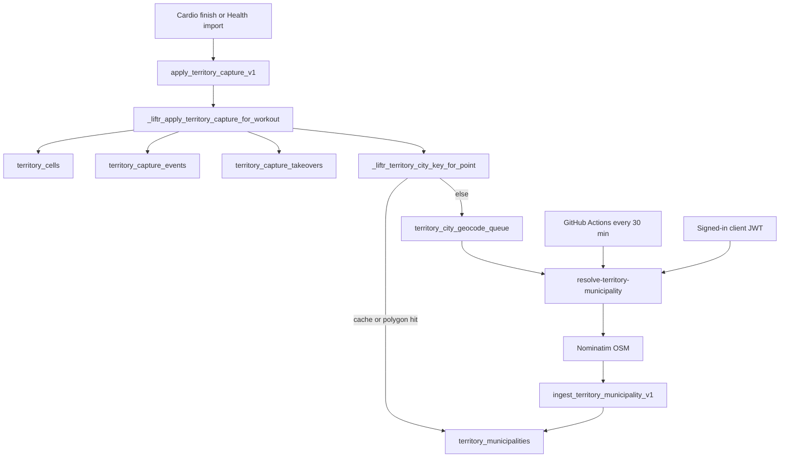

# Territory capture (ops)

Playable hex map on **outdoor GPS cardio**. Clients never insert or update `territory_cells`; capture is a `SECURITY DEFINER` RPC. City labels come from OSM/Nominatim via an edge worker and a geocode queue.

RPC names, loop geometry, and map-load caps stay in [backend-contracts.md](backend-contracts.md). This page is the operational map: when capture runs, what can fail, and how municipalities get ingested.

## Architecture



| Layer | Path |
|-------|------|
| iOS client | [`Liftr/TerritoryCaptureClient.swift`](../Liftr/TerritoryCaptureClient.swift), map [`Liftr/TerritoryMapView.swift`](../Liftr/TerritoryMapView.swift) |
| Android client | [`android/.../territory/TerritoryCaptureClient.kt`](../android/app/src/main/java/com/lilru/liftr/territory/TerritoryCaptureClient.kt), map `ui/territory/` |
| Apply RPC | `apply_territory_capture_v1` → `_liftr_apply_territory_capture_for_workout` |
| Edge | [`Liftr/supabase/functions/resolve-territory-municipality/`](../Liftr/supabase/functions/resolve-territory-municipality/) |
| CI | [`.github/workflows/supabase-edge-territory.yml`](../.github/workflows/supabase-edge-territory.yml) |
| Verify SQL | [`Liftr/supabase/verify/territory_capture_baseline.sql`](../Liftr/supabase/verify/territory_capture_baseline.sql) |

Writes on `territory_cells` / `territory_capture_events` are revoked for `anon` and `authenticated`. Internal `_liftr_*territory*` helpers are also revoked from those roles ([`20260515180200_territory_internal_helpers_lockdown_v1.sql`](../Liftr/supabase/migrations/20260515180200_territory_internal_helpers_lockdown_v1.sql)).

## Capture workflow

`apply_territory_capture_v1(p_workout_id)` requires a signed-in **owner**. It is idempotent: a row in `territory_capture_events` for that workout returns the stored summary with `already_applied: true`.

Clients call it after the workout (and route) exist in Postgres:

| Trigger | Gate in client | Code |
|---------|----------------|------|
| iOS live cardio finish | `usesGPSTracking` and a `routeGeoJSON` line | `ActiveCardioWorkoutView` |
| Android live cardio finish | A route LineString is present | `ActiveCardioWorkoutViewModel` |
| iOS HealthKit import | Not treadmill, and a route is present | `HealthKitCardioImportService` |
| Android Health Connect import | Not stationary bike or treadmill | `HealthConnectToCardio.kt` |

Strength and sport sessions are not capture sources. Indoor cardio can still hit the RPC and get `activity_not_eligible` from the database.

Live preview (does not write cells): `preview_territory_capture_v1(p_route_geojson, p_max_cells)`. Workout detail fill: `get_workout_territory_display_v1` (simplified polygon, not thousands of hexes).

Successful apply with takeovers emits `territory_capture_from_user` (taker) and `territory_lost_to_user` (previous owner), gated by `user_notification_settings.push_territory_*`. Historical backfill calls the helper with `p_emit_notifications = false`.

## Eligibility (server)

Checked in `_liftr_apply_territory_capture_for_workout` (latest body in [`20260515150000_territory_cells_net_new_v1.sql`](../Liftr/supabase/migrations/20260515150000_territory_cells_net_new_v1.sql); geometry helpers later).

| Constraint | Value |
|------------|--------|
| Activity | `run`, `walk`, `hike`, `bike`, `e_bike`, `mtb`, `swim_open_water` (`_liftr_territory_outdoor_activity`) |
| Route | GeoJSON LineString (MultiLineString is merged); otherwise `missing_route` / `invalid_route` |
| Length | ≥ **500 m** or `route_too_short` |
| Speed | If `cardio_sessions.duration_sec > 0`, length/duration ≤ **25 m/s** (~90 km/h) or `speed_unrealistic` |
| Hex grid | `ST_HexagonGrid` edge **25 m** (Web Mercator); `cell_id` is `i:j` |
| Loop vs corridor | Corridor buffer always; closed interior when start/end are close enough — see contracts |

Client copy for `reason` values lives in `TerritoryCapturePresentation.failureMessage` (iOS) and `TerritoryCaptureClient.captureFailureMessage` (Android).

## City assignment and geocode queue

Each captured cell gets a `city_key` via `_liftr_territory_city_key_for_point`:

1. Round lat/lon to **0.01°** buckets (`territory_city_geocode_cache`, **30 day** TTL).
2. Point-in-polygon on `territory_municipalities.boundary_geom` (smallest covering area).
3. Else nearest municipality within **15 km** ([`20260607180000_territory_offshore_nearest_city_fallback_v1.sql`](../Liftr/supabase/migrations/20260607180000_territory_offshore_nearest_city_fallback_v1.sql)).
4. Else enqueue `territory_city_geocode_queue` and leave the cell unassigned (`city_key` null or `grid:…`). UI may show a synthetic **`pending:{bucket_lat}:{bucket_lon}`** city until ingest completes.

`list_territory_city_regions_v1` is `SECURITY DEFINER` and unions real municipalities with those pending keys ([`20260607120000_territory_city_rpc_security_definer_v1.sql`](../Liftr/supabase/migrations/20260607120000_territory_city_rpc_security_definer_v1.sql)).

### Edge function `resolve-territory-municipality`

Nominatim reverse/search (`User-Agent: Liftr/1.0 (territory-municipality-resolve)`), then `ingest_territory_municipality_v1`. Polygon ingest is retried with bbox-only if the polygon RPC fails. **1.1 s** sleep between queue items. Boundaries under **5 km²** (bbox area) are upgraded to a larger administrative relation when possible.

Auth (any one is enough for operator mode):

- Header `x-territory-maintenance-secret` matching Edge secret `TERRITORY_MAINTENANCE_SECRET`
- `Authorization: Bearer` equal to `SUPABASE_SERVICE_ROLE_KEY`

A normal user JWT may **only** drain the queue (`process_queue` not false). Caps: **1** item (users) vs **10** (operators). Users cannot pass `lat`/`lon`, `run_assignment_backfill`, `osm_relation_id`, or `merge_from_city_key`.

Queue failures call `mark_territory_geocode_queue_error_v1` (increment `attempts`, store `last_error`). Rows with **`attempts >= 8`** are deleted.

Operator extras: point ingest (`lat`/`lon`), OSM relation ingest + optional `merge_from_city_key`, and `run_assignment_backfill` → `backfill_territory_municipality_assignments_v1` (service_role only at SQL).

Clients invoke the function with session JWT after backfill / when pending cities exist (`process_queue: true`, `limit`/`max_items`: 1, `run_assignment_backfill: false`). They then call `reconcile_unassigned_territory_cells_v1` (granted to `authenticated`).

## Historical backfill

`backfill_my_territory_captures_v1(p_limit)` applies capture for the caller’s ended cardio workouts that still have a route and no `territory_capture_events` row. Server clamps `p_limit` to **1–25**. Notifications are off.

| Client | When | Batches |
|--------|------|---------|
| iOS | `RootView` `.task` after sign-in, **12 s** delay | `batchSize` 5, **12** batches (`maxBatchesPerVisit`) |
| Android | First open of the territory map, **12 s** delay | `batchSize` 5, **40** batches |

Local “done” flag: `territoryHistoricalBackfillCompletedV2` (UserDefaults / `LiftrPreferences`). Once `has_more` is false, further visits only refresh municipalities.

## GitHub Actions

[`.github/workflows/supabase-edge-territory.yml`](../.github/workflows/supabase-edge-territory.yml):

| Job | When | What |
|-----|------|------|
| `deploy` | Push to `devel` or `main` that touches the function (or this workflow); not on the cron | `supabase functions deploy resolve-territory-municipality --workdir Liftr` |
| `drain-queue` | Cron `*/30 * * * *` or **workflow_dispatch** | POST `process_queue: true`, `max_items: 8`, `run_assignment_backfill: true` |

Required Actions secrets: `SUPABASE_ACCESS_TOKEN` and `SUPABASE_PROJECT_ID` (deploy); `SUPABASE_SERVICE_ROLE_KEY` (drain). Optional `TERRITORY_MAINTENANCE_SECRET` — the drain job already authenticates as the service role bearer.

Edge Function secrets (Supabase dashboard): `SUPABASE_URL`, `SUPABASE_ANON_KEY`, `SUPABASE_SERVICE_ROLE_KEY` (platform defaults), plus `TERRITORY_MAINTENANCE_SECRET` if you want the header path.

Manual drain (same payload as CI):

```bash
curl -sS -X POST "https://<project-ref>.supabase.co/functions/v1/resolve-territory-municipality" \
  -H "Authorization: Bearer <service-role-key>" \
  -H "apikey: <service-role-key>" \
  -H "Content-Type: application/json" \
  -H "x-territory-maintenance-secret: <optional>" \
  -d '{"process_queue":true,"max_items":8,"run_assignment_backfill":true}'
```

Do not run OSM merge/`osm_relation_id` repairs from a user session; those paths return `forbidden_maintenance_repair`.

## Troubleshooting

| Symptom | Likely cause | What to check |
|---------|----------------|---------------|
| Toast `activity_not_eligible` | Indoor activity code | `cardio_sessions.activity_code` / `modality` vs the outdoor list |
| `route_too_short` | GPS track under 500 m | Route GeoJSON length |
| `speed_unrealistic` | Bad timestamps or teleport | `duration_sec` vs `st_length(route)` |
| `missing_route` | Finish without GPS line | iOS requires `usesGPSTracking`; Android requires a LineString |
| Capture ok, city is “Resolving area” | Queue not drained | `territory_city_geocode_queue`; Actions `drain-queue`; Edge logs |
| Pending cities never resolve | Nominatim 429/errors, 8 failed attempts | `last_error`; User-Agent; 1.1 s spacing |
| Cells with null / `grid:` `city_key` | Assignment backfill not running | CI sets `run_assignment_backfill: true`; user JWT cannot |
| Empty foreign cells on the map | Viewport budget | `get_territory_map_v1` fallback in contracts; client pages of 1000 up to 5000 |
| Duplicate capture toast | Harmless | Idempotent event row; `already_applied` |
| Takeover push missing | Preference off or backfill | `push_territory_*`; backfill does not notify |
| `forbidden_point_ingest` in client logs | Body included `lat`/`lon` | User path must be queue-only |

Disk IO of `get_territory_map_v1` and `territory_cells` growth: [supabase-disk-io-monitoring.md](supabase-disk-io-monitoring.md).

## Local checks

```sql
-- Presence of tables/RPCs and sample previews:
-- Liftr/supabase/verify/territory_capture_baseline.sql
```

Client tests (no live Nominatim): `LiftrTests/TerritoryCaptureRegressionTests.swift`, `android/app/src/test/java/com/lilru/liftr/territory/TerritoryCaptureClientTest.kt`.

## Related

- [backend-contracts.md](backend-contracts.md) — Territory RPC/table inventory and loop-capture math
- [xcode-cloud-workflows.md](xcode-cloud-workflows.md) — this edge workflow is GitHub Actions, not Xcode Cloud
- [stakeholder/api-appendix.md](stakeholder/api-appendix.md) — security review notes (RPC-only cell writes)
